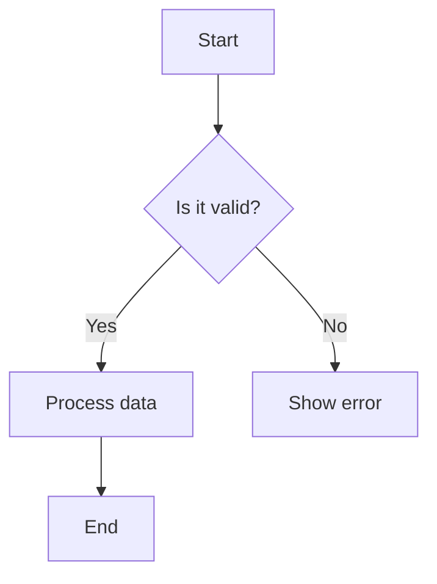
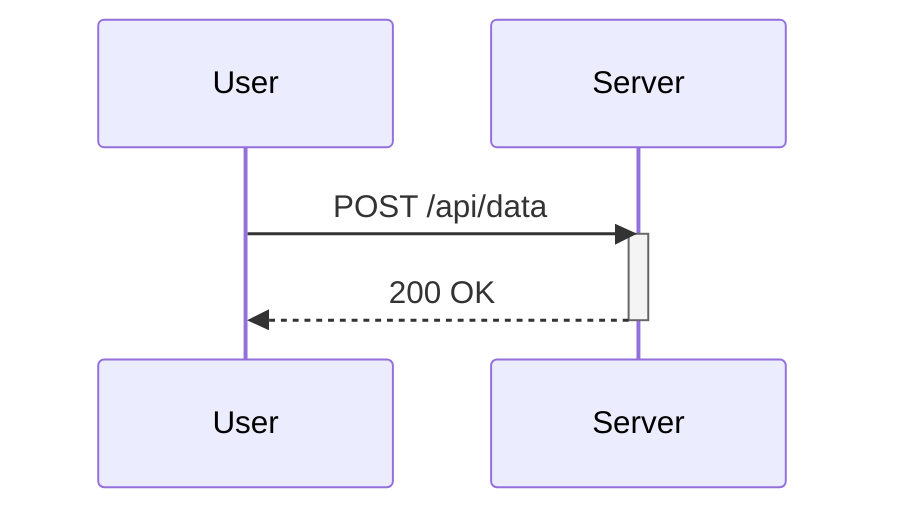
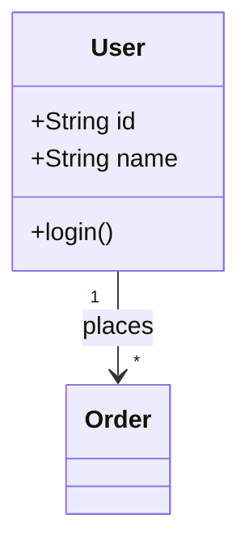
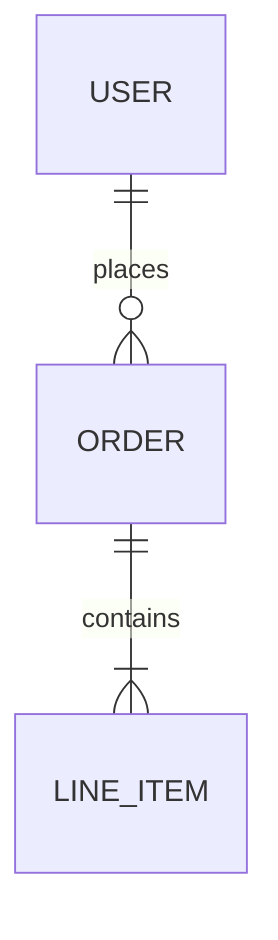
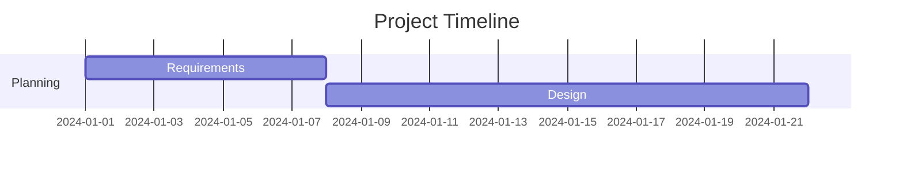
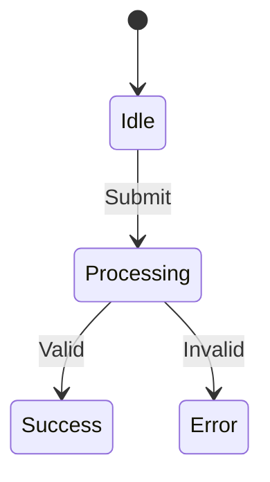
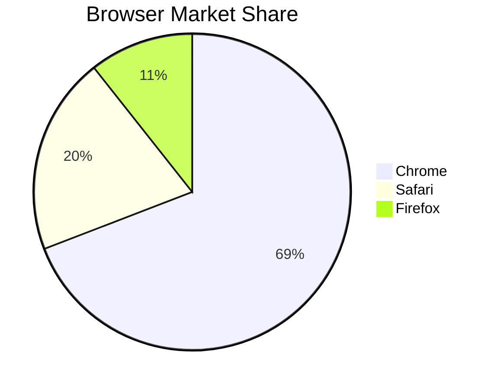

# Mermaid Diagrams

## Flowchart



### Syntax
```
flowchart TD  %% TD = top-down, LR = left-right
    A[Rectangle]    %% Square brackets = rectangle
    B(Rounded)      %% Parentheses = rounded
    C{Diamond}      %% Curly braces = decision
    E[(Database)]   %% Cylinder shape
    
    A --> B         %% Arrow
    B -.-> C        %% Dotted arrow
    C ==> D         %% Thick arrow
```

## Sequence Diagram



## Class Diagram



## ER Diagram



## Gantt Chart



## State Diagram



## Pie Chart



## Resources

- **Mermaid Docs**: https://mermaid.js.org/
- **Live Editor**: https://mermaid.live
